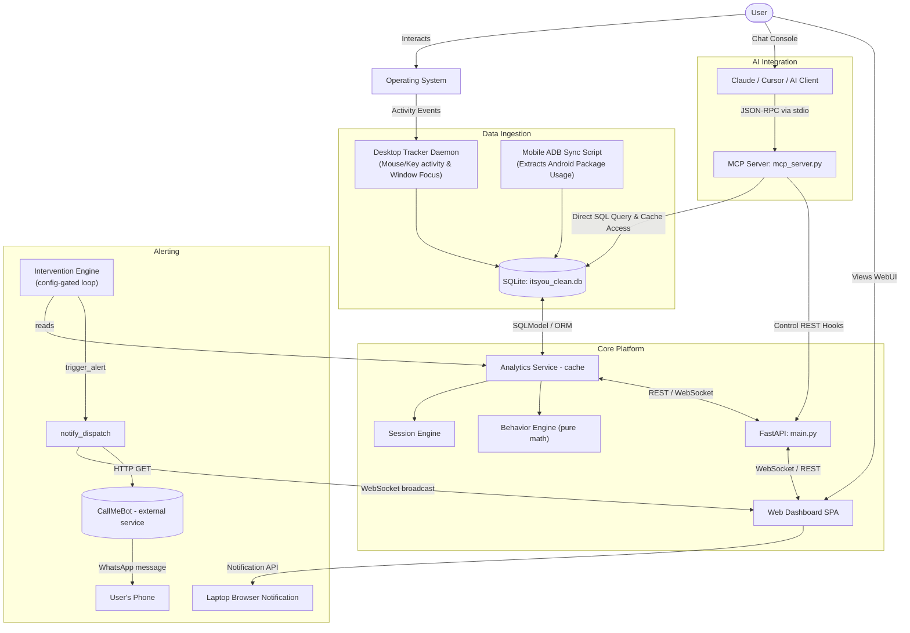

# it'syou — Intelligent Screen Time & Productivity Tracker

[](https://python.org)
[](https://fastapi.tiangolo.com)
[](https://modelcontextprotocol.io)
[](LICENSE)

**it'syou** is a local-first, AI-ready personal productivity telemetry platform. It silently monitors your desktop and mobile screen time in real time, computes advanced psychological metrics like focus efficiency and burnout risks, and exposes everything to your AI assistant (e.g., Claude Desktop, Cursor) via the **Model Context Protocol (MCP)**.

---

## 📐 System Architecture

The following diagram illustrates how the `it'syou` ecosystem monitors user activity, processes data locally, and exposes interfaces to both the user and AI assistants:



---

## 🗂️ Project Directory Tree

```
MCP-server/
├── .vscode/               # Workspace settings
├── docs/                  # System documentation
│   └── mobile_adb_setup.md # Guide to setting up Android ADB sync
├── frontend/              # Dashboard Single Page Application (SPA)
│   ├── components/        # UI modules (charts, widgets)
│   ├── app.js             # Client state, WebSocket management
│   ├── index.html         # Application viewport
│   ├── manifest.json      # Progressive Web App configuration
│   └── sw.js              # Service Worker for push notification interception
├── routers/               # FastAPI route definitions (REST endpoints)
├── scripts/               # Synchronization & automation utilities
│   ├── generate_vapid_keys.py # VAPID setup helper for Web Push
│   └── mobile_adb_sync.py # Device log ingestion automation
├── services/              # Core business intelligence & pipelines
│   ├── analytics.py       # Aggregation caching & database query pipeline
│   ├── behavior_engine.py # Focus efficiency & burnout index calculations
│   ├── notification_dispatch.py # Push notification pipeline
│   └── session_engine.py  # Event reconstruction engine
├── tests/                 # Test coverage suite
├── main.py                # Platform entrance, background threads & REST daemon
├── mcp_server.py          # Model Context Protocol wrapper
├── models.py              # SQLModel schema declarations (SQLite mapping)
└── db.py                  # Local database connections & indexing
```

---

## 🤖 Model Context Protocol (MCP) Integration

The **Model Context Protocol** enables seamless integration between AI clients (like Claude Desktop) and this repository's local datasets. This allows you to chat naturally with your AI assistant regarding your habits, productivity, and focus intervals.

### 🛠️ Exposed MCP Tools

The server exposes 30+ tools for reading status, configuring settings, and requesting analytics:

| Tool | Parameters | Description |
|------|------------|-------------|
| `get_dashboard_metrics` | `days: int` | Fetches complete dashboard aggregates. |
| `get_current_activity` | None | Returns the active application, duration, and device. |
| `get_productivity_score`| `days: int` | Compares verified vs. estimated productivity metrics. |
| `get_focus_efficiency` | `days: int` | Audits context switching and deep focus sessions. |
| `get_burnout_index` | `days: int` | Detects physical overwork/exhaustion indices (0-100). |
| `get_distraction_cost` | `days: int` | Computes opportunity cost wasted on distractions. |
| `get_behavioral_insights` | `days: int` | Reports peak active hours and primary applications. |
| `search_usage` | `app_name: str`| Searches application history logs for a pattern match. |
| `explain_productivity_change`| `question: str, days: int` | Fully deterministic analysis explaining productivity trends. |
| `classify_application` | `app_name: str, classification: str` | Updates an app's focus tag (`productive`, `neutral`, `distracting`). |
| `pause_tracker` / `resume_tracker`| None | Controls the background activity hook state. |

### 📂 Shared Resources

Resources are dynamic files/JSON outputs made accessible directly to the LLM context:

- `dashboard://current` — Today's complete live dashboard snapshot.
- `metrics://today` — Key KPI values (productivity, burnout, distraction cost).
- `events://recent` — Logs of the last 20 keyboard, mouse, focus, or idle state changes.
- `devices://status` — Active device list and tracking status daemon reports.
- `classifications://all` — Complete list of custom classification tags.

### 📝 Prompt Templates

Preconfigured prompts standardizing complex AI workflows:
- `get_prompt_most_distracted` ("What distracted me the most today?")
- `get_prompt_summarize_productivity` ("Summarize today's productivity.")
- `get_prompt_weekly_report` ("Generate a weekly behavioral report.")
- `get_prompt_app_switches` ("How many times did I switch applications?")

---

## 🌍 Real-World Use Cases

* **Passive Time Tracking & Invoicing:** No start/stop buttons. Track precise hours on tools like VS Code, Figma, or Word, and isolate them from non-work activities.
* **Smart Interventions:** Receives alerts if you spend consecutive hours on social media or news feeds without taking breaks.
* **Burnout Prevention:** If the `BehaviorEngine` detects your workdays are regularly stretching beyond 10+ hours or that you're working late into the night, it triggers structural recommendations to enforce rest.
* **Local-First, Privacy-Preserving Analytics:** Unlike cloud trackers, all keystrokes, application titles, and logs reside 100% locally. Zero telemetry leaves your machine.

---

## 🚀 Installation & Running

### 1. Repository Setup

```bash
# Clone the repository
git clone https://github.com/Kondareddy1209/MCP.git
cd MCP

# Configure a virtual environment
python -m venv .venv
.venv\Scripts\activate   # Windows
# source .venv/bin/activate  # Linux/macOS

# Install package dependencies
pip install -r requirements.txt
```

### 2. Start the Backend API & GUI Dashboard

```bash
python -m uvicorn main:app --reload --port 8000
```
Visit [http://localhost:8000](http://localhost:8000) to view the client-side dashboard.

### 3. Launch the MCP Server (For Claude Desktop/Cursor Integration)

Run the Python wrapper directly via:
```bash
python mcp_server.py
```

To configure with your **Claude Desktop Client**, append the following configuration to `%APPDATA%/Claude/claude_desktop_config.json`:

```json
{
  "mcpServers": {
    "itsyou-server": {
      "command": "python",
      "args": [
        "C:/Users/Konda Reddy/OneDrive/Desktop/MCP-server/mcp_server.py"
      ]
    }
  }
}
```

---

## ⚙️ Feature Configuration

Enable/disable modules inside the local `config.json` configuration file:

```json
{
  "run_intervention_engine": true,
  "run_mobile_sync": true,
  "https": {
    "use_https": false
  }
}
```

* **`run_intervention_engine`**: Triggers desktop push notifications on critical overwork/distraction patterns.
* **`run_mobile_sync`**: Launches ADB services to automatically query connected Android phones for application telemetry.

---

## 🛡️ License

Distributed under the MIT License. See `LICENSE` for more information.
